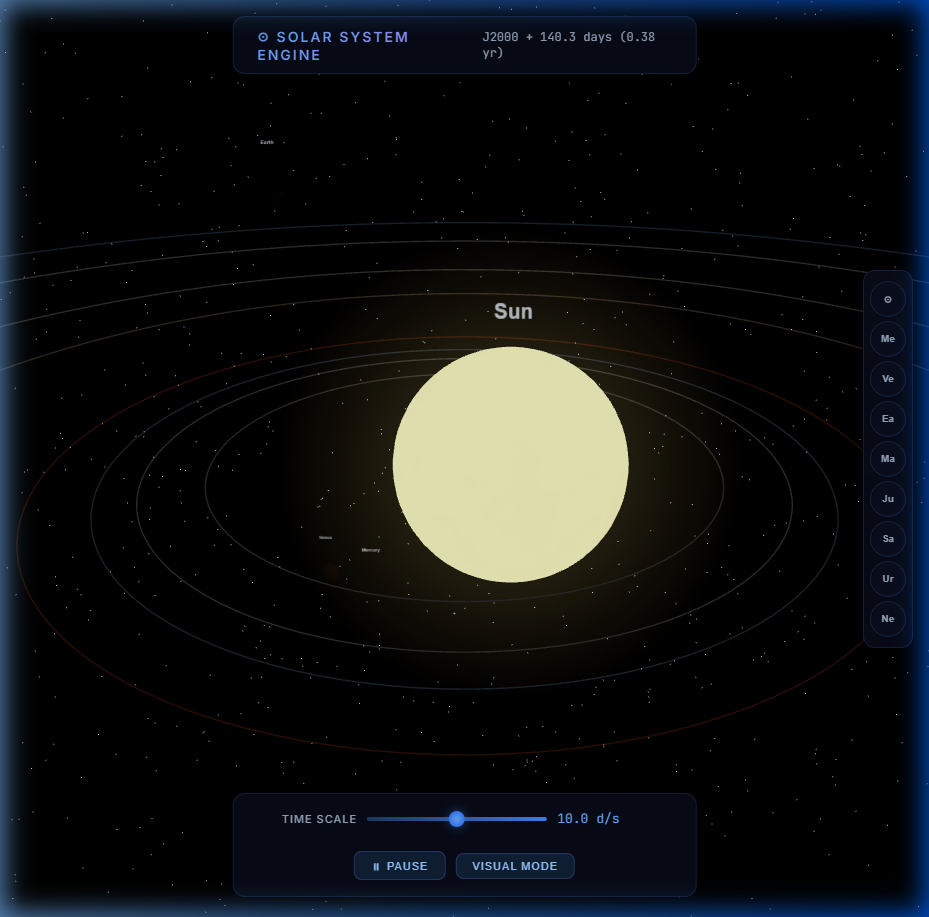
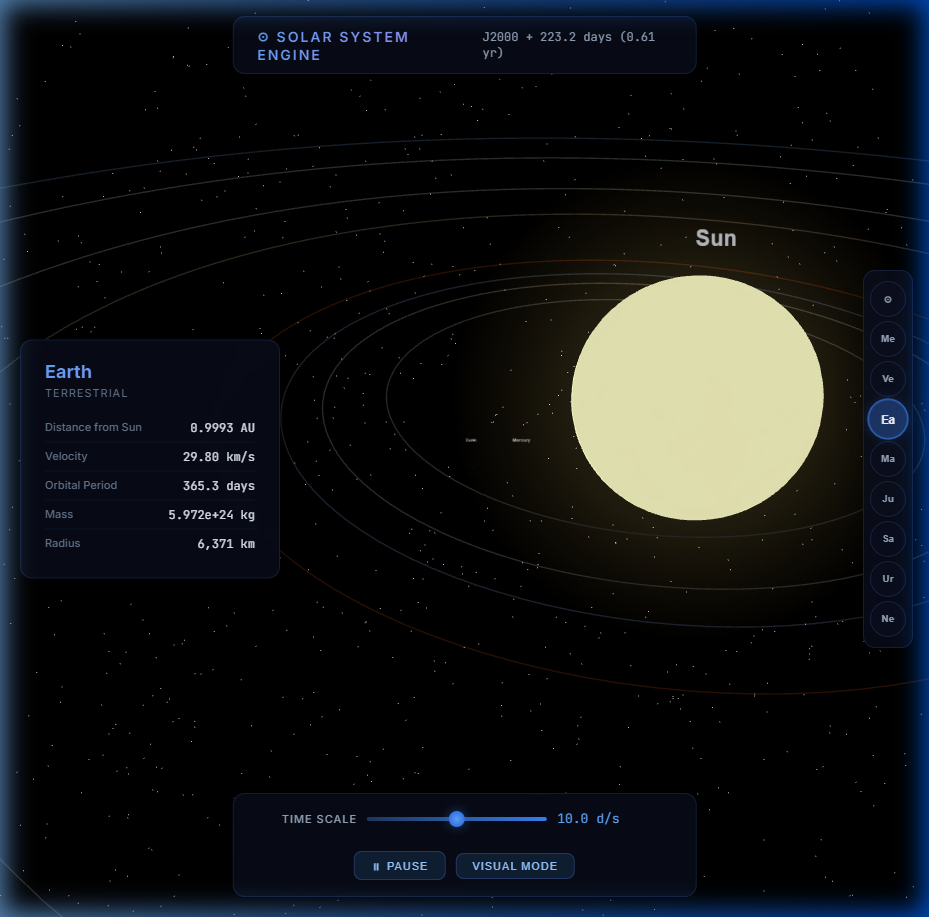
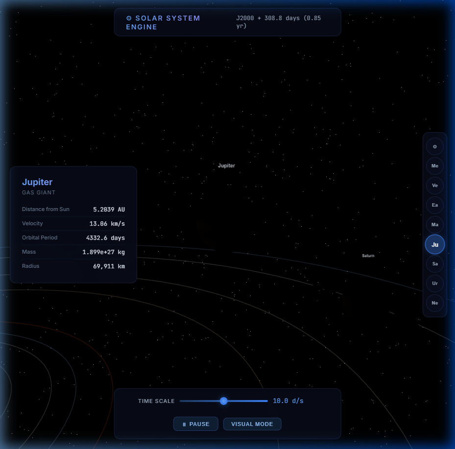

# 🪐 Solar System Engine

An interactive, high-fidelity 3D Solar System simulation built with **Three.js**, featuring real-world physics, N-body gravitation, and NASA-derived astronomical data.

## 🚀 Key Features

- **N-Body Physics**: Implements Newton's Law of Universal Gravitation with **Velocity Verlet integration** for long-term orbital stability.
- **Accurate Astronomical Data**: Uses real-world mass, radius, and initial velocity vectors for the Sun and all eight major planets (Mercury through Neptune).
- **Interactive Camera**: "Space Exploration" camera that allows you to target and snap focus to specific planets.
- **Scale Toggling**:
  - **Visual Mode**: Logarithmic distance scaling for easier navigation and visualization of the entire system.
  - **True Scale**: 1:1 realism where planets are accurately sized relative to their massive orbital distances.
- **Rendering & Visuals**:
  - **Dynamic Lighting**: The Sun acts as a point light source, creating realistic shadows and illumination.
  - **Procedural Textures**: Custom-generated high-resolution textures for all celestial bodies.
  - **Orbital Paths**: LineLoop geometries visualize the plane of the ecliptic.
- **HUD Interface**: Real-time data overlay showing velocity, distance from the Sun, orbital period, and physical properties of selected bodies.

## 🛠️ Tech Stack

- **Core**: HTML5, Vanilla JavaScript (ES6 Modules)
- **3D Engine**: [Three.js](https://threejs.org/) (WebGL)
- **Physics**: Velocity Verlet Integration (N-body)
- **Styling**: Vanilla CSS (Modern UI with Glassmorphism)
- **Data Source**: NASA JPL Ephemerides (Baseline)

## 📸 Screenshots

### Earth HUD & Detail

### Jupiter & Gas Giant Physics

## 🎮 How to Run

Simply open `solar-system.html` in any modern web browser that supports WebGL.

- **Orbit**: Left Click + Drag
- **Zoom**: Scroll / Right Click + Drag
- **Pan**: Center Click + Drag
- **Target Planet**: Click on a planet or use the navigation panel on the right.
- **Toggle Mode**: Use 'V' or the UI button to switch between Visual and True Scale.
- **Pause/Play**: Spacebar or UI button.
- **Time Scale**: Use the slider to speed up or slow down time.

